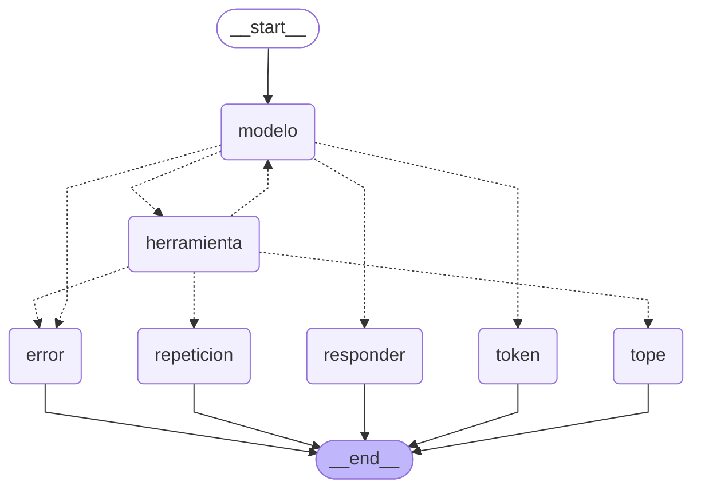

```mermaid
---
config:
  flowchart:
    curve: linear
---
graph TD;
	__start__([<p>__start__</p>]):::first
	modelo(modelo)
	herramienta(herramienta)
	responder(responder)
	tope(tope)
	token(token)
	repeticion(repeticion)
	error(error)
	__end__([<p>__end__</p>]):::last
	__start__ --> modelo;
	herramienta -.-> error;
	herramienta -.-> modelo;
	herramienta -.-> repeticion;
	herramienta -.-> tope;
	modelo -.-> error;
	modelo -.-> herramienta;
	modelo -.-> responder;
	modelo -.-> token;
	error --> __end__;
	repeticion --> __end__;
	responder --> __end__;
	token --> __end__;
	tope --> __end__;
	classDef default fill:#f2f0ff,line-height:1.2
	classDef first fill-opacity:0
	classDef last fill:#bfb6fc

```
